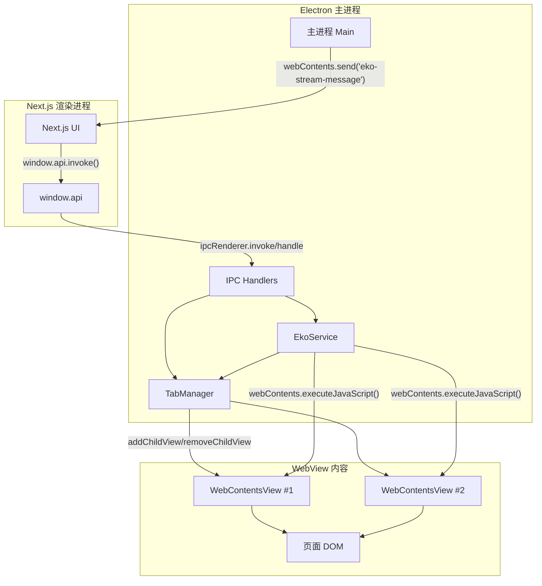
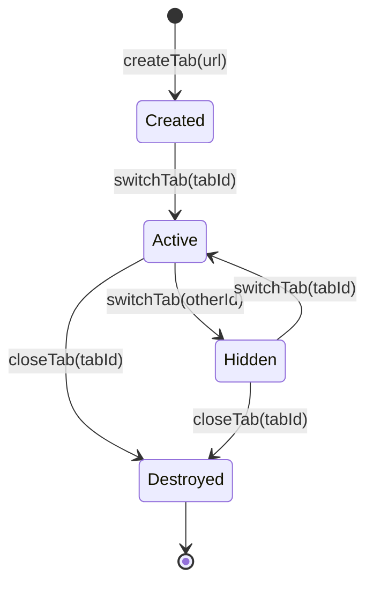
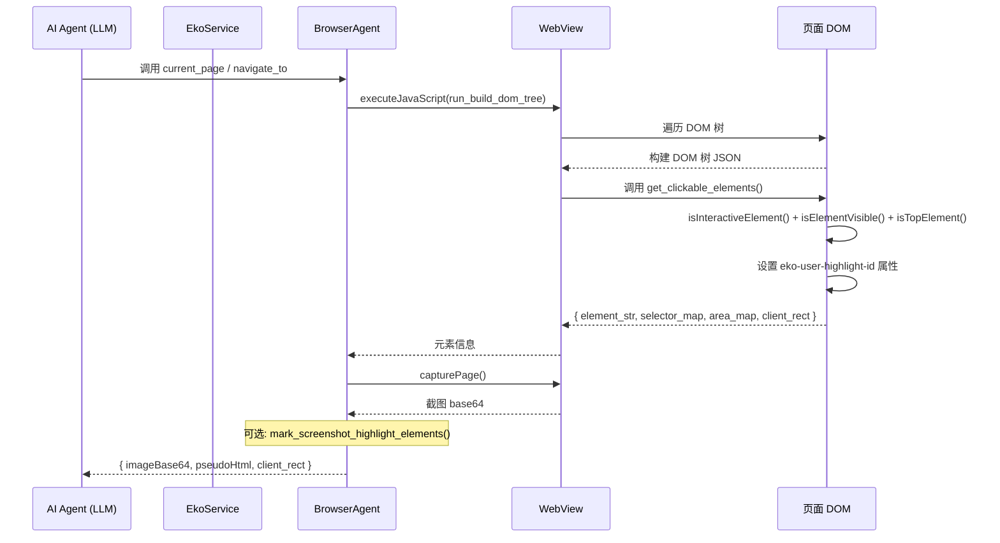
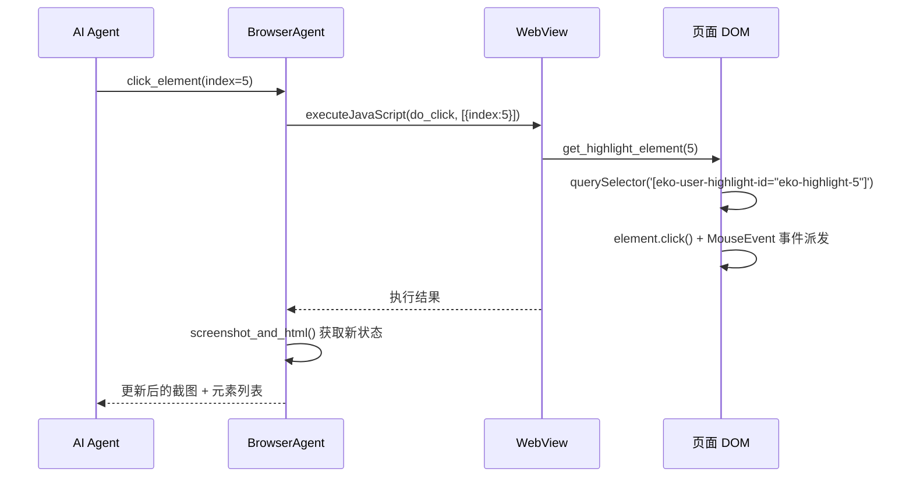
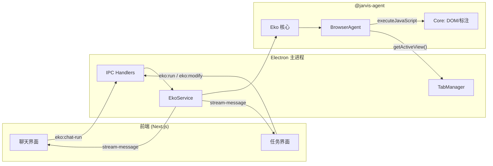

# 进程通讯与 Agent 元素交互

> Electron 多进程间的 IPC 通讯架构，以及 AI Agent 如何通过 DOM 标注系统定位和操作页面元素。

## 概览

AI Browser 的通讯架构分为两条主线：

1. **UI 层通讯**：Next.js 渲染进程（BrowserWindow）通过 Preload + IPC 与 Electron 主进程交互，控制标签页管理、截图、导航等
2. **Agent 层通讯**：AI Agent 通过 `executeJavaScript` 直接向 WebView 注入 JS 脚本，构建 DOM 树、标注可交互元素、执行点击/输入等操作



## 目录结构

```
electron/
├── preload/
│   ├── view.ts          # BrowserWindow 的 preload，暴露 window.api
│   └── modal.ts         # 模态窗口的 preload，暴露 window.modalApi
├── main/
│   ├── ipc/
│   │   ├── index.ts             # IPC 注册入口
│   │   ├── view-handlers.ts     # 视图操作 IPC（截图、导航、标签页）
│   │   ├── eko-handlers.ts      # Eko Agent IPC（运行、修改、取消任务）
│   │   └── agent-handlers.ts    # Agent 配置 IPC
│   └── services/
│       ├── tab-manager.ts       # 多标签页管理器
│       ├── eko-service.ts       # Eko Agent 服务（核心调度）
│       └── window-context-manager.ts  # 多窗口上下文管理
```

## UI 层通讯

### Preload 桥接

Preload 脚本是渲染进程与主进程之间的唯一合法桥梁。通过 `contextBridge.exposeInMainWorld` 将 API 暴露为 `window.api`。

**暴露的 API（`window.api`）：**

| 方法 | 通道 | 方向 | 说明 |
|------|------|------|------|
| `getAppSettings()` | `settings:get` | R→M | 读取应用设置 |
| `saveAppSettings()` | `settings:save` | R→M | 保存应用设置 |
| `sendTTSSubtitle()` | `send-tts-subtitle` | R→M | TTS 字幕数据 |
| `invoke(channel, ...args)` | 任意 | R→M | 通用 IPC invoke |
| `onFileUpdated(cb)` | `file-updated` | M→R | 文件更新通知 |
| `onSettingsUpdated(cb)` | `settings-updated` | M→R | 设置变更通知 |
| `onUIConfigUpdated(cb)` | `ui-config-updated` | M→R | UI 配置变更通知 |

### IPC 通道完整清单

#### 请求-响应型（invoke/handle）

**视图操作（`view-handlers.ts`）：**

| 通道 | 说明 |
|------|------|
| `get-main-view-screenshot` | 截取当前活动标签页截图 |
| `set-detail-view-visible` | 控制视图可见性 |
| `get-current-url` | 获取当前 URL |
| `navigate-detail-view` | 导航到指定 URL |
| `refresh-detail-view` | 刷新当前页面 |
| `go-back-detail-view` | 后退 |
| `go-forward-detail-view` | 前进 |

**Eko 任务管理（`eko-handlers.ts`）：**

| 通道 | 说明 |
|------|------|
| `eko:run` | 运行新任务（生成工作流 → 确认 → 执行） |
| `eko:modify` | 修改已有任务 |
| `eko:execute` | 继续执行已确认的任务 |
| `eko:cancel-task` | 取消任务 |
| `eko:pause-task` | 暂停/恢复任务 |
| `eko:restore-task` | 恢复历史任务 |
| `eko:human-response` | 用户对 human_interact 的回复 |
| `eko:workflow-confirm-response` | 用户对工作流的确认/修改 |
| `eko:regenerate-workflow` | 重新生成工作流 |
| `eko:get-task-context` | 获取任务上下文 |
| `eko:chat-run` | 聊天模式运行 |
| `eko:chat-cancel` | 取消聊天 |

**Agent 配置（`agent-handlers.ts`）：**

| 通道 | 说明 |
|------|------|
| `agent:get-config` | 读取 Agent 配置 |
| `agent:save-config` | 保存并热重载 Agent 配置 |
| `agent:reload-config` | 重载 Agent 配置 |

#### 事件通知型（send/on）

| 通道 | 发送方 | 说明 |
|------|--------|------|
| `tabs-changed` | TabManager | 标签页列表/活动标签变化 |
| `url-changed` | TabManager | 当前标签页 URL 变化 |
| `eko-stream-message` | EkoService | Agent 执行流消息（含多种 type） |
| `eko-config-reloaded` | EkoService | 配置热重载完成 |
| `file-updated` | EkoService | 文件写入实时推送 |
| `settings-updated` | SettingsManager | 设置变更 |
| `ui-config-updated` | SettingsManager | UI 配置变更 |

### `eko-stream-message` 消息类型

这是 Agent 执行过程中的核心消息通道，`type` 字段区分不同消息：

| type | 说明 |
|------|------|
| `text` | Agent 文本输出 |
| `thinking` | 模型推理过程 |
| `tool_use` | 工具调用开始 |
| `tool_streaming` | 工具调用流式输出 |
| `tool_result` | 工具调用结果 |
| `workflow_confirm` | 工作流等待用户确认 |
| `human_interaction` | Agent 请求用户交互（确认/输入/选择/帮助） |
| `human_interaction_result` | 用户交互结果 |
| `error` | 错误信息 |

### 多窗口上下文

系统通过 `WindowContextManager` 支持多窗口。每个 BrowserWindow 有独立的 TabManager 和 EkoService 实例，IPC handler 通过 `event.sender.id` 查找对应的窗口上下文：

```
windowContextManager.getContext(event.sender.id) → { tabManager, ekoService }
```

## TabManager：标签页管理

TabManager 管理 `WebContentsView` 实例的完整生命周期。



**关键设计：**

- 每个标签页对应一个 `WebContentsView`，通过 `mainWindow.contentView.addChildView()` 添加
- 同一时刻只有一个标签页可见（`activeTabId`）
- `window.open` 被拦截，自动创建新标签页（`setWindowOpenHandler`）
- 监听 `did-navigate`、`did-navigate-in-page`、`page-title-updated` 事件自动通知前端
- 至少保留一个标签页，禁止关闭最后一个

## Agent 元素交互

### 策略概述

Agent 采用 **DOM 标注为主、截图视觉辅助** 的混合策略：

- **不使用 OCR 或图像识别** 来检测元素
- 通过遍历 DOM 树，为每个可交互元素分配唯一 index
- 将元素信息序列化为文本描述（pseudo HTML），供 AI 模型理解
- 截图用于视觉确认和布局理解，可选地在截图上绘制标注框

### 元素发现流程



### DOM 树构建与元素标注

**核心函数**（`@jarvis-agent/core` 中的 `run_build_dom_tree`）：

1. **遍历 DOM**：从 `document.body` 开始递归遍历所有节点
2. **过滤**：跳过 `svg`、`script`、`style`、`link`、`meta`、`noscript`、`template`
3. **判断可交互性**：`isInteractiveElement()` — 检查标签名、ARIA role、事件处理器、cursor 样式等
4. **判断可见性**：`isElementVisible()` — 检查尺寸、`visibility`、`display`
5. **判断是否顶层**：`isTopElement()` — 通过 `elementFromPoint` 确认元素未被遮挡
6. **标注**：通过 `eko-user-highlight-id="eko-highlight-{index}"` 属性标记，同时存入 `window.clickable_elements[index]`

**可交互元素判定条件（满足任一）：**

| 类别 | 判定规则 |
|------|----------|
| 标签名 | `a`、`button`、`input`、`select`、`textarea`、`details`、`summary`、`label` 等 |
| ARIA role | `button`、`link`、`checkbox`、`textbox`、`combobox`、`menuitem` 等 |
| tabindex | `tabindex` 属性存在且不为 `-1` |
| 事件处理器 | `onclick`、`ng-click`、`@click`、`v-on:click` |
| 样式 | `cursor: pointer` |
| ARIA 属性 | `aria-expanded`、`aria-pressed`、`aria-selected`、`aria-checked` |
| 其他 | `contenteditable`、`draggable` |

### 元素描述序列化

标注后的元素被序列化为 AI 可读的文本格式：

```
[]: Google                          ← 非交互文本（上下文信息）
[]: 搜索
[5]:<input type="text" name="q">   ← 可交互元素，index=5
[6]:<input type="submit" name="btnK"> Google 搜索
[7]:<a href="https://mail.google.com"> Gmail
```

AI 模型看到这些描述后，通过 index 编号操作对应元素。

### 元素交互执行

AI 模型输出工具调用（如 `click_element(index=5)`），执行链路如下：



**脚本注入方式**：通过 `webContents.executeJavaScript(code, true)` 在 WebView 的页面上下文中执行。`BrowserAgent.execute_script` 将函数序列化为字符串，包装成 async IIFE 执行。

### 截图与标注模式

系统支持三种运行模式（由 `config.mode` 和 `config.markImageMode` 控制）：

| 模式 | 截图 | DOM 标注 | 说明 |
|------|------|----------|------|
| fast | 不截图 | 不标注 | 仅返回 pseudo HTML 文本，性能优先 |
| normal + dom | 截图 | DOM 覆盖层 | 在页面上创建标注 DOM 元素 |
| normal + draw | 截图 + 标注版 | 不标注 | 用 Canvas 在截图上绘制标注框 |

**DOM 标注方式**：创建 `#eko-highlight-container`（`position:fixed; z-index:2147483647`），为每个元素添加带颜色的边框 + index 标签。

**Canvas 标注方式**：在主进程侧通过 `mark_screenshot_highlight_elements()` 用 Canvas API 绘制。

## 与其他模块的交互



## 设计决策

### 为什么用 DOM 标注而不是纯图像识别

DOM 标注方案的精度远高于图像识别（OCR）：能准确获取元素的语义信息（标签名、文本、属性），不受字体/分辨率/渲染差异影响。对于 AI Agent 来说，文本化的元素描述比纯视觉更容易理解。

截图的角色是辅助验证布局和空间关系，而非主要识别手段。

### 为什么用 executeJavaScript 而不是 Preload 脚本

Agent 需要操作的是用户浏览的任意网页 DOM，而非应用自身的页面。`executeJavaScript` 可以在目标页面的上下文中执行代码，直接访问页面的 `document`、`window` 等对象。Preload 脚本只能注入到应用自身的渲染进程。

### 为什么 stream-message 用 send 而不是 invoke

Agent 执行是长时间运行的流式过程，需要持续推送状态更新（thinking、tool_use、tool_result 等）。`send/on` 模式支持一对多推送，而 `invoke/handle` 是单次请求-响应模式，不适合流式场景。

### 为什么 BrowserAgent 复用而非按任务创建

BrowserAgent 不涉及文件存储（与 FileAgent 不同），持有 TabManager 引用即可跨任务使用。创建新 Eko 实例时复用同一个 BrowserAgent，避免重复初始化。

## 关键文件索引

| 文件 | 职责 |
|------|------|
| `electron/preload/view.ts` | BrowserWindow 的 Preload，暴露 `window.api` |
| `electron/main/ipc/view-handlers.ts` | 视图操作 IPC：截图、导航、前进后退 |
| `electron/main/ipc/eko-handlers.ts` | Eko 任务 IPC：运行、修改、取消、人机交互 |
| `electron/main/ipc/agent-handlers.ts` | Agent 配置 IPC |
| `electron/main/services/tab-manager.ts` | 多标签页管理器 |
| `electron/main/services/eko-service.ts` | Eko 核心调度服务 |
| `@jarvis-agent/electron/dist/browser.js` | BrowserAgent 实现（Electron 适配层） |
| `@jarvis-agent/core` (index.esm.js:41714+) | DOM 树构建、元素标注、交互函数 |
