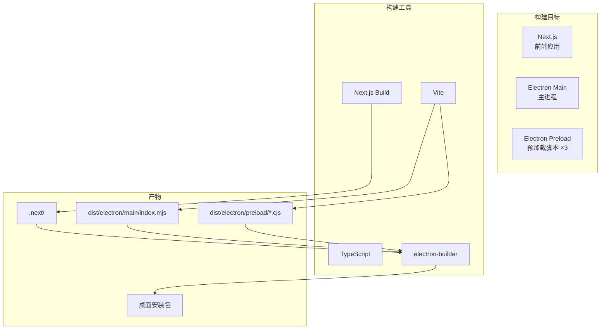
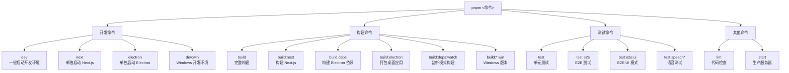
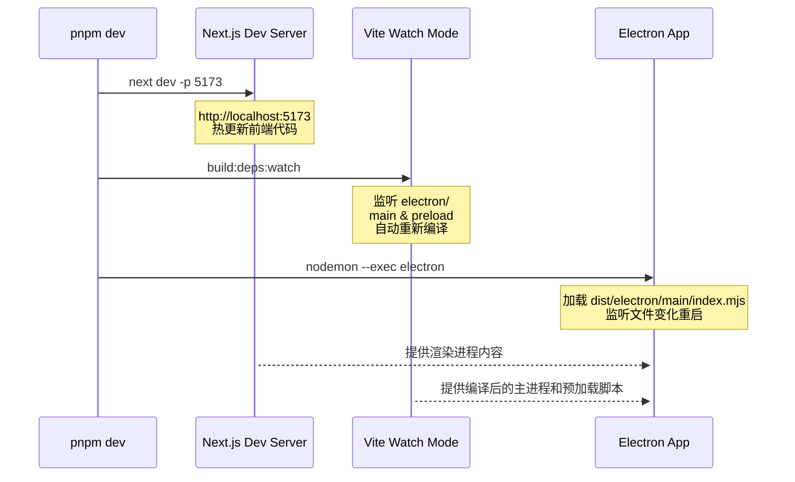
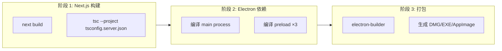
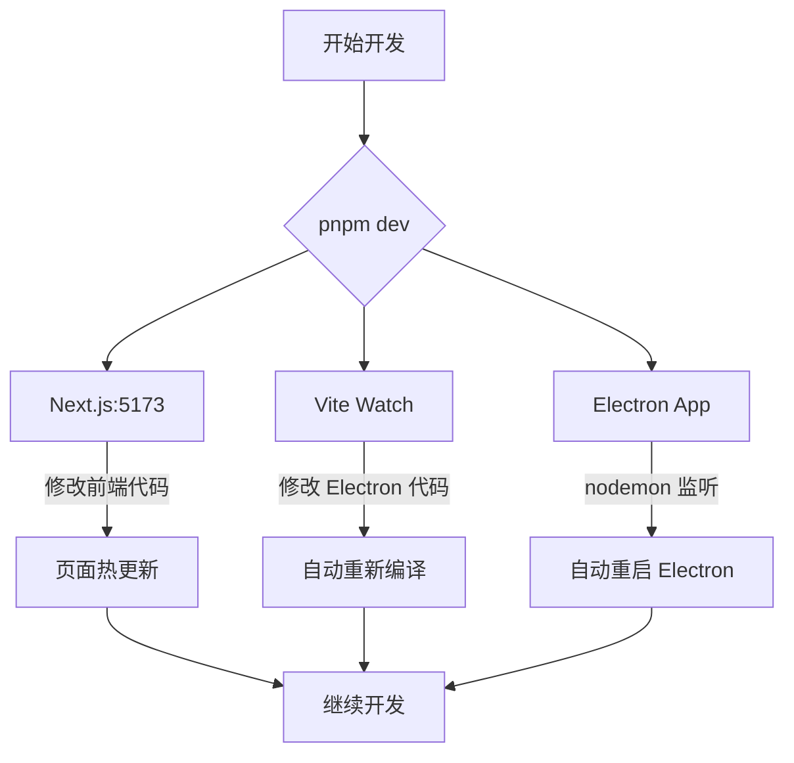

# NPM 命令体系与构建工作流

> 定义项目的开发、构建、测试命令及其依赖关系，是日常开发工作的入口。

## 概览

AI Browser 采用 Next.js 15 + Electron 33 的混合架构，构建系统需要协调三个独立的构建目标：



## 命令分类总览



## 核心命令详解

### 开发命令

#### `dev` — 一键启动开发环境

**命令链：**
```bash
concurrently \
  "next dev -p 5173" \
  "npm run build:deps:watch" \
  "nodemon --exec electron ./dist/electron/main/index.mjs --watch electron"
```

**并行启动三个进程：**



**为什么需要 `build:deps:watch`？**
- Electron 主进程和预加载脚本使用 Vite 构建，不是 Next.js 的一部分
- 开发时需要监听 `electron/` 目录变化，自动重新编译
- 否则修改 Electron 代码后需要手动重启

#### `next` — 单独启动 Next.js

```bash
next dev -p 5173
```

启动 Next.js 开发服务器，端口固定为 5173（Electron 主进程会连接此端口）。

**使用场景：**
- 只调试前端页面，不需要 Electron 桌面功能
- 配合浏览器开发工具调试

#### `electron` — 单独启动 Electron

```bash
electron ./dist/electron/main/index.mjs
```

**前提条件：** 必须先运行 `pnpm run build:deps` 编译 Electron 代码。

**使用场景：**
- 已经有 `build:deps:watch` 在后台运行，只需要重启 Electron
- 调试 Electron 特定功能

### 构建命令

#### `build` — 完整构建流程

**命令链：**
```bash
npm run build:next && npm run build:deps && npm run build:electron
```

**三阶段构建：**



#### `build:next` — 构建 Next.js 应用

```bash
next build && tsc --project tsconfig.server.json --outDir ./
```

**两个步骤：**
1. `next build`：构建 Next.js 前端应用到 `.next/` 目录
2. `tsc`：编译 `server.ts` 为 `server.js`（生产环境启动脚本）

**产物：**
- `.next/` — Next.js 构建产物
- `server.js` — Node.js 服务器入口

#### `build:deps` — 构建 Electron 依赖

```bash
concurrently \
  "ENTRY=index vite build --config electron/preload/vite.config.ts" \
  "ENTRY=view vite build --config electron/preload/vite.config.ts" \
  "ENTRY=modal vite build --config electron/preload/vite.config.ts" \
  "vite build --config electron/main/vite.config.ts"
```

**并行构建四个目标：**

| 目标 | 入口 | 产物 | 用途 |
|------|------|------|------|
| Main Process | `electron/main/index.ts` | `dist/electron/main/index.mjs` | Electron 主进程 |
| Preload Index | `electron/preload/index.ts` | `dist/electron/preload/index.cjs` | 主窗口预加载脚本 |
| Preload View | `electron/preload/view.ts` | `dist/electron/preload/view.cjs` | Agent 视图窗口预加载脚本 |
| Preload Modal | `electron/preload/modal.ts` | `dist/electron/preload/modal.cjs` | 模态窗口预加载脚本 |

**为什么需要三个预加载脚本？**
- **index**：主窗口，提供完整的浏览器功能和 AI Agent 能力
- **view**：Agent 执行时创建的独立视图窗口，隔离上下文
- **modal**：系统级模态对话框（如设置、确认框），需要独立的 IPC 通信

**为什么用 `ENTRY` 环境变量？**
- 三个预加载脚本共享同一个 Vite 配置文件
- 通过 `ENTRY` 区分不同的入口文件
- 避免维护三份几乎相同的配置

#### `build:electron` — 打包桌面应用

```bash
electron-builder
```

使用 `electron-builder.yml` 配置文件，生成平台特定的安装包。

**支持的打包目标：**

| 平台 | 格式 | 产物位置 |
|------|------|----------|
| macOS | DMG (Universal) | `release/` |
| Windows | NSIS installer + ZIP | `release/` |
| Linux | AppImage + deb | `release/` |

**关键配置：**
- **appId**: `deepfundai.browser`
- **文件包含**：`.next/`, `dist/`, `node_modules/`, `public/`, `assets/`
- **ASAR 打包**：默认启用，除了 `electron-update.yml`
- **自动更新**：配置了 GitHub Releases 作为更新源

### 测试命令

#### `test` — 单元测试

```bash
jest
```

运行 Jest 单元测试。

**当前状态：** 项目中暂未发现 Jest 配置文件和测试用例，命令已预留但未启用。

#### `test:e2e` — E2E 测试

```bash
playwright test
```

使用 Playwright 运行端到端测试。

**测试目录：** `e2e/`

**配置要点（`playwright.config.ts`）：**
- 测试超时：60 秒
- 全局超时：5 分钟
- 单进程运行（`workers: 1`）
- 失败时开启 trace 重试

#### `test:e2e:ui` — E2E UI 模式

```bash
playwright test --ui
```

启动 Playwright Test UI，提供可视化测试运行界面。

**功能：**
- 交互式选择和运行测试
- 查看测试截图和视频
- 时间旅行调试

#### `test:speech*` — 语音识别测试

```bash
pnpm run test:speech                # 运行语音测试
pnpm run test:speech:install        # 安装 Vosk 依赖
pnpm run test:speech:download-model # 下载中文模型
```

**语音识别方案：**
- **离线方案**：Vosk（`vosk-browser`）
- **在线方案**：微软认知服务（`microsoft-cognitiveservices-speech-sdk`）

**模型下载：** 从 `alphacephei.com` 下载 `vosk-model-small-cn-0.22` 中文小模型。

### Windows 特殊命令

所有以 `:win` 结尾的命令都是 Windows 平台的等价版本。

**核心差异：** 环境变量语法

```bash
# Unix/macOS
ENTRY=index vite build ...

# Windows
set ENTRY=index&& vite build ...
```

**为什么需要单独维护？**
- Windows CMD 不支持 Unix 的环境变量设置语法
- `concurrently` 在 Windows 上需要使用 `set` 命令
- 使用 `&&` 而不是空格分隔命令

## 构建配置文件

### Vite 配置

#### `electron/main/vite.config.ts` — 主进程构建

**关键配置：**
```typescript
{
  build: {
    lib: {
      entry: 'electron/main/index.ts',
      formats: ['es']  // ESM 格式
    },
    rollupOptions: {
      external: ['electron', 'electron-log', 'fs', ...],  // 外部化 Node.js 模块
      output: {
        entryFileNames: 'main/[name].mjs',
        format: 'esm'
      }
    }
  }
}
```

**设计决策：**
- **ESM 格式**：主进程使用 ESM 而非 CJS，与现代 Node.js 保持一致
- **外部化依赖**：不将 Node.js 内置模块和 Electron 模块打包，运行时从 node_modules 加载
- **不压缩**：`minify: false`，便于调试

#### `electron/preload/vite.config.ts` — 预加载脚本构建

**关键配置：**
```typescript
const entryFile = process.env.ENTRY;  // 从环境变量读取入口

{
  build: {
    lib: {
      entry: `electron/preload/${entryFile}.ts`,
      formats: ['cjs']  // 必须是 CJS
    },
    rollupOptions: {
      external: ['electron'],
      output: {
        entryFileNames: `preload/${entryFile}.cjs`,
        format: 'cjs'
      }
    }
  }
}
```

**设计决策：**
- **CJS 格式**：Electron 预加载脚本必须使用 CommonJS，否则会报错
- **禁用 chunk 分割**：`manualChunks: undefined`，预加载脚本应该保持单文件

### Next.js 配置 (`next.config.js`)

**关键配置：**
```javascript
{
  reactStrictMode: true,
  devIndicators: false,  // 隐藏开发模式角标

  eslint: { ignoreDuringBuilds: true },
  typescript: { ignoreBuildErrors: true },  // 加快构建速度

  env: {
    TTS_KEY: process.env.TTS_KEY,
    TTS_REGION: process.env.TTS_REGION
  },

  headers() {
    return [{
      source: '/api/mcp/(.*)',
      headers: [
        { key: 'Access-Control-Allow-Origin', value: '*' },
        ...
      ]
    }]
  }
}
```

**设计决策：**
- **忽略类型检查**：构建时不运行 TypeScript 类型检查，由 IDE 和 `tsc --noEmit` 负责
- **CORS 配置**：为 MCP API 路由配置跨域访问
- **环境变量注入**：将 TTS 相关环境变量注入客户端

### Electron Builder 配置 (`electron-builder.yml`)

**关键配置：**
```yaml
appId: deepfundai.browser
productName: DeepFundAIBrowser

files:
  - .next/**/*
  - dist/electron/**/*
  - node_modules/**/*
  - server.js

extraMetadata:
  main: dist/electron/main/index.mjs

mac:
  target: [dmg]
  hardenedRuntime: true
  entitlements: "assets/entitlements.mac.plist"

publish:
  provider: github
  owner: deepfundai
  repo: browser
```

**设计决策：**
- **包含 node_modules**：因为使用了 ASAR 打包，需要将依赖打包进去
- **hardenedRuntime**：macOS 启用 hardened runtime，提高安全性
- **GitHub Releases**：自动发布到 GitHub Releases，支持自动更新
- **中国镜像**：`electronDownload.mirror` 使用 npmmirror 镜像加速下载

## 开发工作流

### 日常开发流程



### 发布流程


**版本管理：**
- 使用语义化版本号（`0.2.3`）
- Git tag 触发自动构建和发布
- `electron-updater` 自动检查更新

## 设计决策

### 为什么使用 `concurrently` 而不是 `&`？

**问题：** 在 shell 中使用 `&` 启动后台进程：
```bash
next dev & npm run build:deps:watch & electron
```

**缺点：**
- 进程输出混杂在一起，难以调试
- 无法统一管理进程退出
- Windows 兼容性问题

**解决方案：** 使用 `concurrently`：
- 统一的日志格式，带进程名称前缀
- 一个进程退出时自动结束其他进程
- 跨平台兼容

### 为什么预加载脚本要分成三个文件？

**技术原因：**
- Electron 的 `BrowserWindow` 每个实例可以加载不同的预加载脚本
- 不同的窗口有不同的权限和 API 需求

**安全原因：**
- 主窗口需要完整的浏览器 API（`window.electronAPI.fullBrowser`）
- Agent 视图窗口只需要受限的 API（`window.electronAPI.viewOnly`）
- 模态窗口只需要对话框相关的 API

**好处：**
- 最小权限原则：每个窗口只暴露必要的 API
- 隔离性：Agent 代码运行在独立上下文，无法访问主窗口的敏感 API

### 为什么 `build:deps` 不打包 Next.js？

**原因：**
- Electron 的渲染进程由 Next.js 管理，不在 Electron 的构建范围内
- Next.js 有自己的构建系统（`next build`）
- `build:electron` 打包时直接复制 `.next/` 目录

**流程：**
```
1. next build → .next/
2. build:deps → dist/electron/
3. build:electron → 复制 .next/ 和 dist/electron/ 到安装包
```

### 为什么开发时需要 `build:deps:watch`？

**问题：**
- Electron 主进程和预加载脚本不是 JavaScript，需要编译
- Next.js 的热更新不覆盖 Electron 代码

**解决方案：**
- Vite watch 模式监听 `electron/` 目录变化
- 文件变化时自动重新编译到 `dist/electron/`
- nodemon 监听 `dist/electron/` 变化，自动重启 Electron

**为什么不直接用 `electron --inspect`？**
- TypeScript 不能直接运行，必须先编译
- `tsc` 的 watch 模式不如 Vite 的增量编译快
- Vite 提供更好的源码映射（source map）支持

### 为什么 Windows 需要单独的命令？

**根本原因：** 环境变量语法不兼容

```bash
# Unix/macOS（Bash/Zsh）
ENTRY=index command

# Windows（CMD）
set ENTRY=index&& command

# Windows（PowerShell）
$env:ENTRY='index'; command
```

**为什么不使用跨平台的解决方案？**
- `cross-env` 可以解决，但增加依赖
- 项目主要在 macOS 上开发，Windows 是次要平台
- 单独维护 Windows 命令更灵活，可以针对 Windows 优化

### 为什么禁用构建时的类型检查？

```javascript
// next.config.js
typescript: { ignoreBuildErrors: true }
```

**原因：**
- Next.js 的类型检查比较慢，会拖慢构建速度
- 开发时 IDE 已经提供实时类型检查
- CI/CD 流水线可以单独运行类型检查

**最佳实践：**
```bash
# 开发时
pnpm dev              # 快速启动，IDE 负责类型检查

# 提交前
pnpm run type-check   # 单独运行完整类型检查（建议添加此命令）
```

## 关键文件索引

| 文件 | 职责 |
|------|------|
| `package.json` | 定义所有 npm 命令和依赖 |
| `electron/main/vite.config.ts` | 主进程构建配置 |
| `electron/preload/vite.config.ts` | 预加载脚本构建配置（支持 ENTRY 环境变量） |
| `next.config.js` | Next.js 构建和运行时配置 |
| `electron-builder.yml` | Electron 打包配置 |
| `playwright.config.ts` | E2E 测试配置 |
| `server.ts` | 生产环境 Next.js 服务器入口 |
| `tsconfig.server.json` | 服务端 TypeScript 编译配置 |

## 常见问题

### Q: 修改 Electron 代码后不生效？

**A:** 检查是否在运行 `build:deps:watch`。如果没有，手动重新运行 `build:deps`。

### Q: Windows 上运行 `dev` 报错？

**A:** 使用 `dev:win` 命令，或切换到 PowerShell 并修改环境变量语法。

### Q: 打包后应用无法启动？

**A:** 检查：
1. 是否完整运行了 `build` 命令（不是 `build:next-only`）
2. `dist/electron/main/index.mjs` 是否存在
3. `electron-builder.yml` 中的 `extraMetadata.main` 路径是否正确

### Q: E2E 测试超时？

**A:** 检查：
1. 是否先启动了开发服务器（`pnpm dev`）
2. 端口 5173 是否被占用
3. 增加 `playwright.config.ts` 中的 `timeout` 值

### Q: 语音识别不工作？

**A:**
1. 运行 `test:speech:install` 安装依赖
2. 运行 `test:speech:download-model` 下载模型
3. 检查 `.env` 中的 TTS_KEY 和 TTS_REGION
