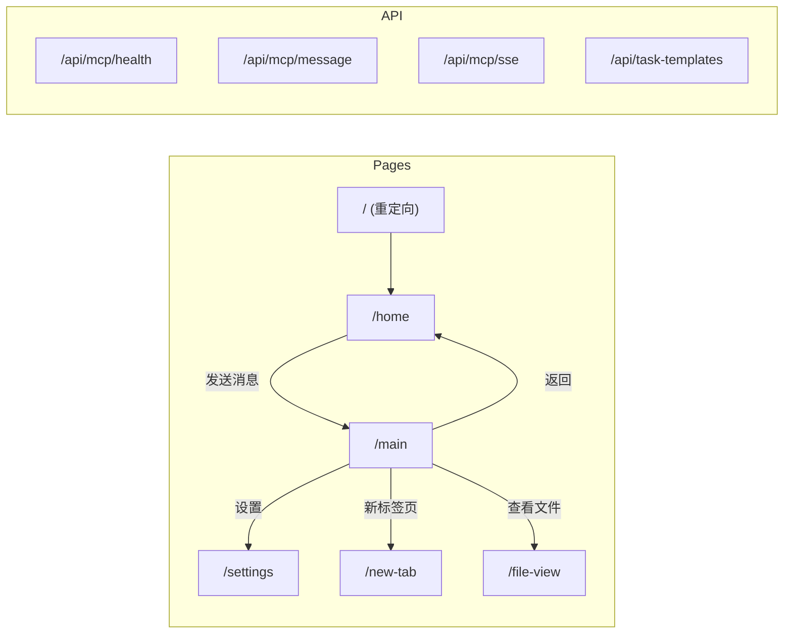
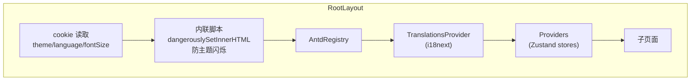
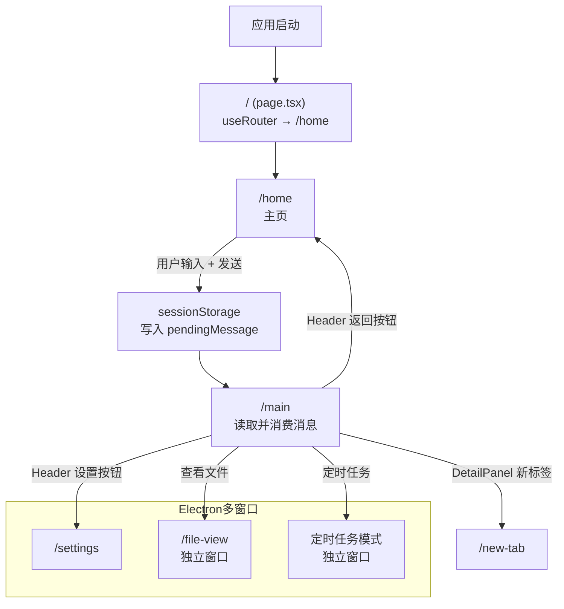
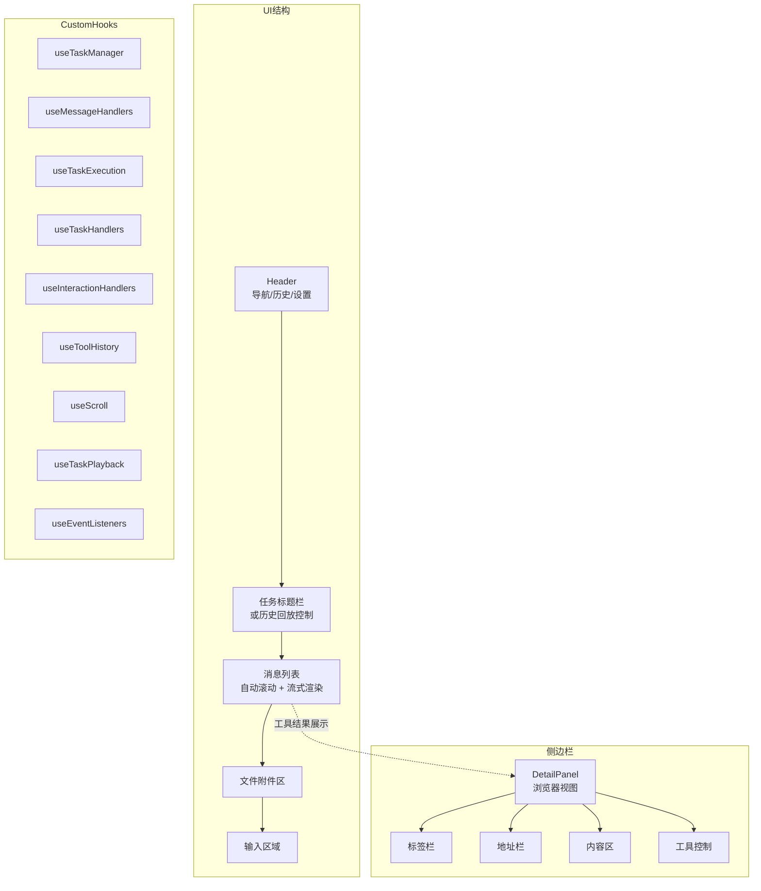

# 页面路由系统

> Next.js App Router 架构下的页面路由设计与页面间关系。

## 概览

项目使用 Next.js 15 App Router（`src/app/` 目录），共 6 个页面 + 6 个 API 路由。所有页面均为客户端组件，通过单一的根 Layout 提供全局主题、国际化、Ant Design 注册等能力。



## 目录结构

```
src/app/
├── layout.tsx          # 根布局：主题、i18n、Ant Design、Providers
├── page.tsx            # 根页面：自动重定向到 /home
├── home/
│   └── page.tsx        # 主页：AI 聊天输入、模型选择、语音输入
├── main/
│   └── page.tsx        # 核心交互页：AI 对话 + 任务执行 + 历史回放
├── new-tab/
│   └── page.tsx        # 浏览器新标签页：搜索引擎 + URL 导航
├── settings/
│   └── page.tsx        # 设置页：集中配置界面
├── file-view/
│   └── page.tsx        # 文件查看器：代码预览 + 语法高亮
└── api/
    ├── mcp/
    │   ├── health/route.ts    # MCP 健康检查
    │   ├── message/route.ts   # MCP JSON-RPC 消息
    │   └── sse/route.ts       # MCP SSE 实时通信
    ├── task-templates/route.ts # 任务模板
    └── test/                   # 测试端点（抖音、小红书）
```

## 核心设计

### 根布局 (layout.tsx)

根布局负责全局基础设施，所有页面共享：



**防闪烁策略**：通过 `dangerouslySetInnerHTML` 注入内联脚本，在 React hydration 之前立即读取 cookie 并应用主题 class，避免深色/浅色模式切换时的白屏闪烁。

### 页面间数据传递

页面之间不使用 Next.js 原生路由参数，而是通过以下方式传递状态：

| 方式 | 场景 | 示例 |
|------|------|------|
| URL query params | 任务跳转 | `/main?taskId=xxx&executionId=xxx` |
| sessionStorage | 消息暂存 | home 页写入 pending message，main 页读取并消费 |
| Zustand store | 全局状态 | `historyStore`（历史面板状态）、`settingsStore`（设置同步） |
| Electron IPC | 跨窗口通信 | 文件查看器、设置窗口通过 `window.api` 通信 |

### 页面关系与导航流



## 各页面职责

### `/` — 根重定向

简单的客户端重定向，`useEffect` 中调用 `router.push('/home')`，渲染 `null`。

### `/home` — 主页

AI 聊天的入口页面，核心元素：
- **渐变边框输入框**：用户输入 AI 指令
- **ModelSelector**：选择 AI 模型/Provider
- **ModeSwitch**：Chat（对话）与 Explore（工作流）模式切换
- **语音输入按钮**：录音状态指示器
- **SkillCommandPopover**：输入 `/` 触发技能命令补全

发送消息前校验 Provider 有效性，有效则跳转 `/main` 并将消息暂存 sessionStorage。

### `/main` — 核心交互页

应用最复杂的页面，使用 10+ 自定义 Hook 拆解逻辑：



**历史回放**：通过 `useTaskPlayback` hook 控制已保存任务的回放，支持 0.5x ~ 50x 变速播放。

### `/settings` — 设置页

包装 `SettingsLayout` 组件，提供：
- 可拖拽标题栏（Electron 窗口）
- Tab 式面板导航（通用、Provider、聊天、Agent 等 10+ 面板）
- 导入/导出/重置功能
- 未保存变更检测
- Framer Motion 动画过渡

### `/new-tab` — 新标签页

简洁的搜索界面：
- 配置搜索引擎（百度、Google 等，从设置读取）
- URL 自动检测与直接导航
- 渐变背景

### `/file-view` — 文件查看器

独立窗口打开，功能：
- 代码预览 + 语法高亮
- Web 预览模式（iframe）
- 文件统计（行数、字数）
- 复制/下载
- 通过 IPC 实时更新文件内容

## 状态管理

页面间的全局状态通过 Zustand 管理：

| Store | 职责 | 使用页面 |
|-------|------|----------|
| `settingsStore` | 全局设置，IPC 同步 Electron 主进程 | 所有页面 |
| `historyStore` | 历史面板可见性、选中的历史任务 | /main |
| `scheduledTaskStore` | 定时任务管理 | /home, /main |
| `languageStore` | 当前语言 | layout 层 |

## 设计决策

### 为什么所有页面都是客户端组件？

这是一个 Electron 桌面应用，所有页面都依赖 Electron 的 `window.api` 进行 IPC 通信（文件系统、窗口管理等），这些 API 只在客户端可用。因此所有页面标记 `"use client"` 是合理的。

### 为什么使用 sessionStorage 传递消息而不是 URL params？

消息内容可能很长（包含文件附件、复杂指令），放在 URL query 中会暴露在地址栏且长度受限。sessionStorage 提供了临时、大容量的一次性传递方案。

### 为什么没有嵌套 Layout？

各页面差异较大（/main 有 DetailPanel 侧边栏，/settings 有独立 Tab 结构），强行共享嵌套 Layout 会引入不必要的条件逻辑。每个页面自行管理布局更清晰。

## 关键文件索引

| 文件 | 职责 |
|------|------|
| `src/app/layout.tsx` | 根布局：主题、i18n、全局 Provider |
| `src/app/page.tsx` | 根重定向 → /home |
| `src/app/home/page.tsx` | 主页：AI 输入入口 |
| `src/app/main/page.tsx` | 核心交互页：AI 对话 + 任务管理 |
| `src/app/new-tab/page.tsx` | 新标签页：搜索 + 导航 |
| `src/app/settings/page.tsx` | 设置页 |
| `src/app/file-view/page.tsx` | 文件查看器 |
| `src/components/Header.tsx` | 共享头部导航组件 |
| `src/components/chat/` | 聊天相关组件（InputArea, MessageList, DetailPanel 等） |
| `src/components/settings/SettingsLayout.tsx` | 设置页布局和面板管理 |
| `src/stores/historyStore.ts` | 历史面板状态 |
| `src/stores/settingsStore.ts` | 全局设置状态 |
| `middleware.ts` | cookie → 请求头注入（theme/language/fontSize） |
