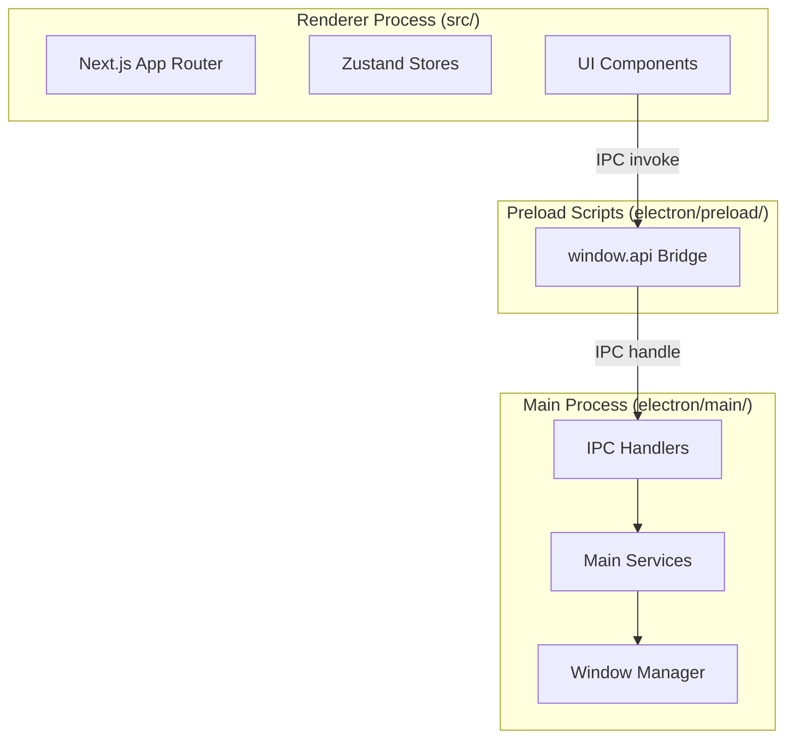

# 项目架构

## 多进程架构

应用采用 Electron 多进程架构，进程间通过 IPC 通信：

- **Main Process** (`electron/main/`): 应用生命周期、窗口管理、系统托盘、原生 API、IPC 处理
- **Renderer Process** (`src/`): Next.js App Router 应用，负责 UI 渲染和用户交互
- **Preload Scripts** (`electron/preload/`): 安全桥梁，通过 `window.api` 暴露 API，使用 context isolation

## 构建系统

- **Next.js** 构建 Web 应用（`next build`）
- **Vite** 构建 Electron main process（ESM → `dist/electron/main/index.mjs`）和 preload scripts（CJS → `dist/electron/preload/*.cjs`）
- 路径别名：`@/*` → `./src/*`

## 核心模块

| 模块 | 路径 | 职责 |
|------|------|------|
| IPC Handlers | `electron/main/ipc/` | 11 个处理器：agent, config, eko, file, history, memory, settings, skill, tab, view |
| Main Services | `electron/main/services/` | eko-service(核心编排), tab-manager, task-scheduler, memory, search-provider 等 |
| Zustand Stores | `src/stores/` | settingsStore, historyStore, scheduled-task-store, languageStore |
| Custom Hooks | `src/hooks/` | 18 个 hooks：useTaskExecution, useTabManager, useSettingsState, useVoiceInput 等 |
| UI Components | `src/components/` | 按功能分组：chat/, history/, settings/, scheduled-task/, playback/, file-preview/ |
| i18n | `src/locales/` | 中英文翻译，使用 i18next + react-i18next |

## AI Agent 架构

- **@jarvis-agent/core**: 核心框架（基于 Eko）
- **双模式交互**:
  - **Chat Mode**: ChatAgent 流式对话 + 内联工具调用
  - **Deep Explore Mode**: 多步骤工作流生成 → 用户确认 → 多 Agent 协同执行
- **MCP 协议**: 通过 `/api/mcp/message` 和 `/api/mcp/sse` 路由支持动态工具发现和执行
- **Memory System**: BM25 + 向量余弦相似度的混合搜索，LLM 自动提取记忆

## 设置系统

使用 electron-store 持久化配置（JSON），支持 6 个设置面板（Providers, General, Chat, Agent, UI, Network），跨窗口实时同步，支持导入/导出。
